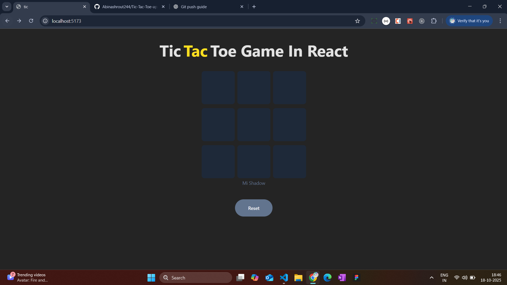

# React + Vite
# 🎮 Tic Tac Toe Game (React)

A simple and interactive **Tic Tac Toe** game built with **React ⚛️**!  
Play as ❌ or ⭕

---

## ✨ Features

- 🎯 Classic 3x3 Tic Tac Toe board  
- 🔁 Real-time turn switching between X and O  
- 🏆 Auto win detection and draw condition  
- 🔄 Reset button to restart anytime  
- ⚡ Fast, clean, and responsive design using React + Tailwind

---

## 🧠 How It Works

1. Players take turns clicking empty boxes  
2. The game checks after every move:
   - ✅ If a player has won  
   - 🤝 Or if the match ends in a draw  
3. Once a winner is found, the board locks until reset  

---

## 🧩 Tech Stack

- ⚛️ **React.js** – UI and logic  
- 🎨 **Tailwind CSS** – Styling  
- 🧰 **Lucide Icons** – For cool icons  
- 💡 **useState + useRef Hooks** – For state management and DOM updates  

---

;
